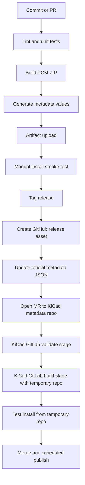

# KiGitSync KiCad Plugin Packaging and Submission Report

## Executive Summary

Target KiCad stable release: **unspecified**. Target Python minor version: **unspecified**. The safest engineering conclusion is that **KiGitSync should be designed as a PCM-distributable KiCad plugin package first, with a release artifact that conforms exactly to KiCad’s addon ZIP layout and metadata rules, while the source repository can use a cleaner development layout and generate the flat release ZIP during CI**. For broad compatibility across current KiCad installations, a legacy SWIG action plugin remains the most compatible path because the PCM metadata runtime defaults to `swig` and KiCad still supports SWIG plugins in 9.x; however, SWIG is officially deprecated as of KiCad 9.0 and is planned for removal in KiCad 11.0, so an IPC migration plan should be treated as part of the product roadmap, not optional technical debt. citeturn2view0turn20view0turn40view0turn17view0

A second strategic finding is that **KiCad 10 already includes built-in Git integration in the Project Manager**: it can initialize repositories, commit, push, pull, switch branches, and clone projects. That means KiGitSync should not be positioned as “generic Git for KiCad” on KiCad 10+, because that value already exists natively. Its differentiator should instead be **GitHub-oriented automation** such as one-click repository creation, opinionated KiCad `.gitignore`, standardized commit messages, optional release ZIP export for PCM/self-hosting, and safe GitHub authentication via external tooling rather than embedded secrets. citeturn44view0turn44view2

For official inclusion in the KiCad addon ecosystem, the hard requirements are concentrated in four places: the KiCad Addons developer guide, the PCM JSON schemas, the PCB Editor/plugin documentation, and the official metadata repository workflow. Those sources require an exact archive structure, an English metadata record, open-source licensing compatible with GNU GPL for code plugins, public issue tracking, a public direct download URL, a valid SHA-256 for the release archive in the submission metadata, and submission through a merge request to the official metadata repository rather than the generated public repository. The metadata repository also provides a packaging toolkit and CI validation workflow that should be treated as part of the acceptance path. citeturn2view0turn4view0turn4view3turn20view0turn39view0

## Official Acceptance Envelope

KiCad’s official addon publication guide defines the package archive format, metadata rules, content policy, submission path, and repository compatibility behavior. A PCM package is a ZIP archive with an exact folder structure; unrelated extra files are explicitly forbidden. For a Python plugin, the archive root must contain `plugins/`, optional `resources/icon.png`, and `metadata.json`. The plugin code must live directly under `plugins/` and not inside another nested folder in the release archive. A PCM listing icon, if provided, is a 64×64 PNG in `resources/`, while a toolbar icon for an action plugin is a separate, smaller 24×24 PNG inside `plugins/`. citeturn2view0turn27search0turn40view0

Official-repository acceptance adds non-negotiable policy constraints beyond packaging. The package identifier must be namespaced in reverse-DNS style; if the project is hosted publicly, KiCad recommends a namespace based on the host, for example `com.github.username.packagename`. The package must be unique, must not be a trivial fork/copy of an existing package, and if the submitter is not clearly the maintainer, KiCad requires written confirmation from a maintainer. Code plugins must use an open-source license compatible with GNU GPL, metadata must be in English, the package source must be hosted somewhere that supports issue reporting, the download URL must be public, and `download_sha256` must be present in the metadata submitted to the official metadata repository. KiCad also reserves the right to reject or remove packages on code-of-conduct, security, safety, privacy, or abandonment grounds. citeturn4view0turn4view1turn4view3

The official submission route is also explicit. New packages and updates are submitted as merge requests to the official metadata repository, not to the generated public-facing repository. In that repository, the submitter creates `packages/<identifier>/metadata.json` and any optional supporting files such as an icon. The metadata repository README adds practical workflow requirements that do not appear in the shorter publication guide: use the repository’s packaging toolkit, validate locally before opening the MR, push to a branch in your fork so GitLab CI runs validation, inspect the temporary test repository produced by the pipeline, test-install the package in KiCad from that temporary repository, and only then open the merge request. citeturn4view3turn39view0

Two documentation mismatches are important enough to call out explicitly because they affect review risk. First, the prose guide says `identifier` may contain only alphanumerics and dashes and be between 2 and 50 characters, yet the official schema pattern clearly accepts dotted reverse-DNS identifiers and up to roughly 100 characters, and the guide’s own examples use dots. Second, the prose guide says the short description is capped at 150 characters, while the schema allows 500. The engineering-safe response is to follow the **stricter prose limits** where they conflict, while still using the **schema-compatible dotted reverse-DNS identifier** that KiCad itself recommends in examples. For KiGitSync, the safe identifier is `com.github.<your-user>.kigitsync`. citeturn27search0turn20view0

The table below summarizes the practical acceptance envelope for KiGitSync.

| Topic | What KiCad officially requires | Safe implementation for KiGitSync |
|---|---|---|
| Archive format | ZIP, exact folder layout, no unrelated files | Generate a deterministic release ZIP in CI |
| Package identifier | Reverse-DNS namespacing for official repo | `com.github.<user>.kigitsync` |
| Metadata language | English | All metadata and README summary in English |
| Licensing | Open source; code license GPL-compatible | GPL-3.0-or-later, or another GPL-compatible license |
| Source hosting | Public host with issue tracking | Public repo with Issues enabled |
| Download URL | Public direct download URL | Release asset URL |
| Integrity | `download_sha256` in submission metadata | CI computes SHA-256 |
| Submission path | MR to official metadata repo | Separate automation for metadata updates |
| Content policy | No CoC/security/privacy violations | Explicit consent, no token storage, clear network behavior |
| Abandonment | Broken stable support >90 days with no feedback can trigger edits/removal | Maintain compatibility matrix and respond to breakage reports |

Source notes for the table: KiCad Addons publication guide, official PCM schema, and official metadata repository workflow. citeturn4view0turn4view1turn4view3turn20view0turn39view0

## Packaging and Runtime Architecture

For a SWIG-based action plugin, the most important technical sources are the PCB Editor user manual and the PCB Python Bindings developer page. The latter shows the action-plugin discovery contract: KiCad discovers Python scripts/packages in plugin search paths, the plugin must include a class derived from `pcbnew.ActionPlugin`, and the class’s `register()` method must be called during module/package import. The documented complex-plugin pattern is a Python package containing `__init__.py`, an action module, optional other modules/resources, and optional `__main__.py` for standalone execution. The developer page explicitly recommends naming the file containing the `ActionPlugin` subclass as `<package-name>_action.py`, and shows `__init__.py` as the preferred place to instantiate and register the plugin for package-based plugins. citeturn40view0

The same documentation also defines the action-plugin UI contract. The `defaults()` method sets `name`, `category`, `description`, and optionally `show_toolbar_button` and `icon_file_name`; `show_toolbar_button` only sets a default, because users can override toolbar visibility in PCB Editor preferences. If `icon_file_name` is supplied, it must be an absolute path to a PNG, and the developer guide recommends 24×24 pixels. The API reference additionally exposes `dark_icon_file_name`, which is useful for dark themes even though it is not required. In the PCB Editor user manual, detected action plugins appear in Preferences and can also appear in Tools → External Plugins and optionally on the top toolbar. citeturn40view0turn8view1turn2view3

The packaging distinction between **source tree** and **release tree** is critical. KiCad’s PCM archive for a Python plugin must look like this:

```text
Archive root/
├─ plugins/
│  ├─ __init__.py
│  ├─ kigitsync_action.py
│  ├─ gitignore_template.txt
│  ├─ toolbar.png
│  └─ ...
├─ resources/
│  └─ icon.png
└─ metadata.json
```

That flat PCM archive requirement does **not** mean the Git source repository must be equally flat. The best engineering pattern is a normal source repo with a build step that assembles the flat artifact. That avoids polluting the project root while still satisfying PCM. This recommendation directly follows from KiCad’s release-archive rule that the plugin content be placed directly inside the archive’s `plugins/` directory and the action-plugin package pattern documented by KiCad. citeturn2view0turn40view0

A good source-repository layout for KiGitSync is therefore:

```text
repo/
├─ src/kigitsync/
│  ├─ __init__.py
│  ├─ kigitsync_action.py
│  ├─ ui.py
│  ├─ gitops.py
│  ├─ github_cli.py
│  ├─ assets/
│  │  └─ toolbar.png
│  └─ data/
│     └─ gitignore_template.txt
├─ packaging/
│  ├─ metadata.in.json
│  └─ icon.png
├─ tests/
├─ scripts/
│  └─ build_pcm_zip.py
├─ README.md
├─ CHANGELOG.md
├─ LICENSE
└─ .github/workflows/
```

The build script should stage the ZIP as KiCad expects it:

```text
stage/
├─ plugins/
│  ├─ __init__.py
│  ├─ kigitsync_action.py
│  ├─ ui.py
│  ├─ gitops.py
│  ├─ github_cli.py
│  ├─ toolbar.png
│  └─ gitignore_template.txt
├─ resources/
│  └─ icon.png
└─ metadata.json
```

That separation lets engineers use modern Python project hygiene during development while still shipping the exact PCM artifact KiCad requires. citeturn2view0turn40view0

For versioning and metadata, the current state of the official sources is slightly nuanced. KiCad’s guide says the package version format is “up to you,” but the current official schema uses a numeric dotted pattern consistent with SemVer-like `major.minor.patch`; it also supports optional `version_epoch`, optional `platforms`, optional `runtime`, `kicad_version`, and optional `kicad_version_max`. The guide further states that the `download_*` fields belong only in the metadata submitted to the repository, not the `metadata.json` embedded inside the archive. The metadata repository README reinforces that the archive-internal `metadata.json` should contain only one version entry for the packaged release and should **not** have populated `download_*` fields. For KiGitSync, the safe scheme is a numeric release version such as `0.1.0` or `1.0.0`, with `kicad_version` and — if validation on future major releases is incomplete — `kicad_version_max` set conservatively. citeturn20view0turn27search0turn39view0

Manual-install and PCM-install locations should be documented separately. KiCad 8 and 9 user manuals explicitly document the manual script folder as versioned under each user profile: Linux `~/.local/share/kicad/<version>/scripting/plugins`, macOS `~/Documents/KiCad/<version>/scripting/plugins`, Windows `%HOME%\Documents\KiCad\<version>\scripting\plugins`. For PCM-installed content, the manuals do not spell out one absolute path table in the gathered sources, but they do define `KICAD9_3RD_PARTY` and `KICAD10_3RD_PARTY` as the location for plugins/libraries/themes installed by PCM, and they expose an “Open Package Directory” button to show the real path on the user’s machine. Because the legacy SWIG developer page and the newer user manuals differ in the exact search-path examples, KiGitSync’s diagnostics should **query and display the actual runtime paths** rather than assuming a single universal location. citeturn3view1turn12view1turn12view0turn31view1turn31view0turn40view0

| Install mode | KiCad 8 documented location | KiCad 9 documented location | KiCad 10 documented in gathered sources |
|---|---|---|---|
| Manual SWIG plugin install, Linux | `~/.local/share/kicad/8.0/scripting/plugins` | `~/.local/share/kicad/9.0/scripting/plugins` | Not explicitly found in the gathered user-manual pages; do not hardcode without checking runtime paths |
| Manual SWIG plugin install, macOS | `~/Documents/KiCad/8.0/scripting/plugins` | `~/Documents/KiCad/9.0/scripting/plugins` | Not explicitly found in the gathered user-manual pages; do not hardcode without checking runtime paths |
| Manual SWIG plugin install, Windows | `%HOME%\Documents\KiCad\8.0\scripting\plugins` | `%HOME%\Documents\KiCad\9.0\scripting\plugins` | Not explicitly found in the gathered user-manual pages; do not hardcode without checking runtime paths |
| PCM install, all platforms | Under `KICAD8_3RD_PARTY` | Under `KICAD9_3RD_PARTY` | Under `KICAD10_3RD_PARTY` |

Source notes for the table: KiCad 8/9 PCB Editor manuals and KiCad 9/10 path-variable documentation. citeturn2view2turn3view1turn12view1turn12view0

If KiGitSync targets KiCad 10+ only, the IPC path deserves serious consideration. KiCad’s IPC documentation says the plugin system supports Python-based and executable plugins, Python IPC plugins run in an external interpreter, KiCad creates a per-plugin virtual environment automatically, and plugin dependencies can be declared and installed into that environment. KiCad 10 Preferences also expose “Enable KiCad API” and “Path to Python interpreter” for IPC plugins. That is a much cleaner long-term architecture for GitHub automation than SWIG, especially because SWIG is deprecated. But if KiGitSync must support KiCad 6/7/8/9, the compatibility path remains a SWIG action plugin for now. citeturn17view0turn12view3turn40view0

```mermaid
flowchart TD
    A[KiGitSync source repository] --> B[Build step assembles PCM ZIP]
    B --> C[ZIP root with plugins/ resources/ metadata.json]
    C --> D{Install path}
    D -->|PCM| E[KICADx_3RD_PARTY package directory]
    D -->|Manual| F[versioned scripting/plugins directory]
    E --> G[KiCad startup or plugin refresh]
    F --> G
    G --> H[Import package or script]
    H --> I[__init__.py runs]
    I --> J[Instantiate pcbnew.ActionPlugin subclass]
    J --> K[register()]
    K --> L[Tools → External Plugins]
    K --> M[Toolbar button if enabled]
    L --> N[Run()]
    M --> N
    N --> O[Consent dialog]
    O --> P[git / gh subprocess operations]
```

## Compatibility, Quality, and UX

The compatibility story for KiGitSync must be written down explicitly because the official sources show a moving platform. SWIG-based `pcbnew` bindings are still usable today, but KiCad’s own developer docs say they are deprecated as of 9.0, unstable across major versions, and planned for removal in 11.0. Separately, KiCad 10 introduces both an IPC plugin model and native Git integration in the Project Manager. The correct compatibility posture is therefore:

- **If the product goal is “runs on currently deployed KiCad 6–10 installations”**: ship a SWIG action plugin now, avoid deep or exotic API usage, test against each target major version, and publish a roadmap issue to add IPC support later. citeturn40view0turn20view0
- **If the product goal is “best long-term architecture, KiCad 10+ only”**: use IPC and the official `kicad-python` bindings, because that is the stable direction KiCad is documenting for modern plugin development. citeturn17view0turn17view2

The official docs do not pin a single Python minor version for addon authors. What they do say is that SWIG bindings are generated for Python 3 and installed so they can be imported by Python 3 interpreters on the system, while IPC plugins use the Python interpreter configured in KiCad and a KiCad-managed virtual environment. For an engineer, that means **“Python version unspecified” must be treated as an actual release-management constraint**: CI should test the plugin against the Python version bundled or selected by each target KiCad build, not just against a single generic CPython version. citeturn40view0turn12view3turn17view0

External dependencies are another area where official policy is sparse but official/community guidance is consistent. The metadata repository’s local packaging toolkit itself warns that on platforms where KiCad bundles Python, you should use KiCad’s Python or otherwise ensure `wxPython` compatibility. On the KiCad forum, a maintainer explicitly recommends reducing third-party dependencies as much as possible and designing the plugin to fail gracefully with installation instructions when a dependency is absent. For KiGitSync, that advice aligns perfectly with the product: **prefer zero Python dependencies and rely on system `git` plus external `gh` CLI**, because that avoids bundling network libraries, credential libraries, and platform-specific binary dependencies into the plugin. citeturn39view0turn6search8

Built-in Git integration in KiCad 10 also changes UX decisions. Since KiCad 10 can already initialize repos, commit, push, pull, and switch branches, KiGitSync should avoid becoming a second-class duplicate SCM UI. The better pattern is a narrow, high-confidence workflow: detect current project, check whether it is under Git, confirm the intended remote/repository name, offer optional `.gitignore` bootstrap, generate a clear commit message, and delegate actual remote creation/authentication to external GitHub tooling. On KiCad 10+, documentation should explicitly say that generic Git operations may already be available natively in the Project Manager; KiGitSync primarily adds GitHub-oriented automation. citeturn44view0turn44view2

For user-facing text and dialogs, KiCad’s UI policy is not addon-specific acceptance policy, but it is still a strong consistency reference. It says visible strings should follow KiCad capitalization rules, phrases should not end with trailing periods, full error messages should, command buttons use header capitalization, tooltips should explain non-obvious controls, menu entries that open a dialog for more input should use an ellipsis, dialogs should use platform conventions and flexible sizers, and strings should be spelled out rather than abbreviated for translation. KiGitSync should adopt those rules even though it is not core KiCad, because reviewers and users will still judge it by KiCad interaction quality. citeturn42view0

A concrete UX recommendation for KiGitSync is this: **the plugin should ask for confirmation before any remote/network-changing action, but not before safe local inspections**. That is not a published addon acceptance rule, but it is the lowest-risk design given KiCad’s content-policy language around security/privacy issues and the fact that GitHub-facing actions can create repositories or push private design data. The plugin should therefore separate “inspect” from “mutate”: “Check git status,” “Validate gh auth,” and “Preview files to commit” can be silent/local; “Create GitHub repository,” “Push to remote,” and “Open browser-based auth” should always be explicit user actions. citeturn4view1turn34search0turn34search1

## Licensing, Security, and Privacy

KiCad’s official addon publication guide is explicit that code plugins in the official repository must be open source and must use a license compatible with the GNU GPL. The GNU licensing pages explain that GNU projects normally use GPL-compatible free software licenses, and the GNU license list is the canonical compatibility reference. For KiGitSync specifically, the most review-friendly choices are **GPL-3.0-or-later** if you want the simplest alignment with KiCad’s ecosystem, or a well-known GPL-compatible permissive license such as **MIT/Expat** or **BSD-2-Clause/BSD-3-Clause** if you want lower downstream friction; **Apache-2.0** is GPLv3-compatible and therefore acceptable for GPLv3-compatible contexts, but it is still better to verify organizational preferences before choosing it. citeturn4view0turn33search4turn33search0turn33search10

For official-repo review efficiency, I recommend **GPL-3.0-or-later** unless there is a compelling reason not to. It cleanly satisfies KiCad’s “GPL-compatible” rule, avoids reviewer doubt, and makes any future incorporation of shared snippets or examples from the broader KiCad ecosystem less legally awkward. If the project team strongly prefers permissive licensing, MIT/Expat is a simpler choice than Apache-2.0 for this specific plugin because KiGitSync is not a core networking library or SDK and does not need Apache’s patent framing to achieve its product goal. This is a recommendation, not a KiCad rule. citeturn4view0turn33search0turn33search4

A minimal licensing package should include a top-level `LICENSE` file with the full chosen license text, SPDX headers in source files if your team uses them, and a short contributor policy in `CONTRIBUTING.md` stating that contributions are accepted under the project’s outbound license. KiCad’s official addon docs do not require a separate contributor guide, but they do require open-source reviewability, maintainer traceability, and issue reporting, and those are served by a standard `CONTRIBUTING.md` plus `CODE_OF_CONDUCT.md` or a pointer to the KiCad community code-of-conduct standard. citeturn4view0turn4view1

Security posture for KiGitSync should be conservative. **Do not store GitHub tokens inside the plugin, inside KiCad project files, or inside the plugin package directory.** The official GitHub CLI authentication flow already provides a browser-based login and stores credentials in the system credential store when available; if no credential store exists, `gh` may fall back to a plaintext file, and users can inspect that location via `gh auth status`. That means the safest plugin design is to *delegate authentication to `gh auth login` or preexisting authenticated Git settings* and avoid ever requesting, parsing, storing, or echoing tokens yourself. citeturn34search0turn34search6

For CI and release automation, the security baseline is different from the desktop plugin. GitHub Actions officially supports the ephemeral `GITHUB_TOKEN`, and GitHub recommends limiting access via minimal permissions and, where PATs are unavoidable, using fine-grained tokens with the minimum repository scope needed. For KiGitSync’s own repository automation, release upload and metadata-generation jobs should use `GITHUB_TOKEN` where possible, and any manual token use should be isolated to repository administrators, not plugin end users. citeturn34search5turn34search2

If KiGitSync ever adds optional commercial-service integration beyond ordinary Git/GitHub workflows — especially PCB fabrication, order-management, or commercial service APIs — KiCad’s commercial-services policy becomes relevant. As currently scoped, a GitHub sync plugin does **not** obviously fall into the documented fabrication/order-management category, but if the product evolves toward direct service-provider integrations, the KiCad team may require a separate discussion/contract with that provider before official-repo inclusion. That future boundary should be tracked now to avoid architecture drift. citeturn4view1turn4view2

## Testing, CI, and Release Engineering

The official addon publication guide does **not** currently impose mandatory automated tests for plugin acceptance, but the official metadata repository workflow *does* impose automated validation of package metadata and package buildability through CI. The metadata repo README says the packaging toolkit can perform almost all of the automated checks run by the GitLab repository, and the recommended workflow is to validate locally, push to a branch in your fork, inspect CI results, then install/test from the temporary repository produced by the pipeline. That means the minimum acceptance-grade CI for KiGitSync is not “unit tests only”; it is **schema/package validation plus installability testing**. citeturn39view0

For plugin-internal tests, the best available KiCad-specific guidance in the gathered sources comes from an experienced official-repo plugin maintainer on the KiCad forum: keep a CLI mode if possible so integration tests can run from the command line, decouple business logic from the GUI, and isolate compatibility hacks for different KiCad/wx versions into one file or shim layer. That advice is directly applicable to KiGitSync. The plugin should not bury Git/GitHub logic inside event handlers. Instead, it should separate:
- project detection,
- file filtering,
- commit-message generation,
- `.gitignore` generation,
- subprocess invocation,
- GUI prompts.

That split will make both unit and integration tests feasible. citeturn14search0

A release-quality test plan for KiGitSync should therefore include:

| Test layer | Purpose | Recommended implementation |
|---|---|---|
| Unit tests | Deterministic logic | Pure-Python tests for commit message generation, repo-name normalization, file selection, `.gitignore` templates, metadata rendering |
| Subprocess contract tests | Git/GitHub command construction | Mock `subprocess.run` and assert exact argv, cwd, timeout, and error mapping |
| Packaging validation | PCM correctness | Build ZIP and validate via KiCad metadata repo packaging toolkit |
| Smoke install test | KiCad detection/import | Install ZIP in a test KiCad profile and confirm plugin appears in External Plugins / Preferences |
| Manual matrix | End-user confidence | Test at least one Windows, one Linux, and one macOS environment if claiming cross-platform support |
| Version matrix | Compatibility confidence | Test each supported KiCad major version explicitly; do not assume SWIG portability |

Source notes for the table: official metadata repo README and KiCad maintainer testing guidance. citeturn39view0turn14search0

A practical GitHub Actions setup should have at least two workflows: one for push/PR validation, and one for tagged releases. The push/PR workflow should lint, unit-test, assemble the PCM ZIP, run metadata validation, and upload the ZIP as an artifact. The tagged-release workflow should produce the final ZIP, compute SHA-256 and sizes, create the release, then output the metadata values needed for the official metadata-repo MR. Because GitHub officially documents `GITHUB_TOKEN` as the workflow authentication mechanism, this is the least-friction default for repository automation. citeturn34search5turn34search7turn39view0

Example validation workflow:

```yaml
name: ci

on:
  pull_request:
  push:
    branches: [main]

permissions:
  contents: read

jobs:
  test-and-package:
    runs-on: ubuntu-latest
    steps:
      - uses: actions/checkout@v4

      - uses: actions/setup-python@v5
        with:
          python-version: '3.11'

      - name: Install test deps
        run: |
          python -m pip install --upgrade pip
          pip install pytest ruff

      - name: Lint
        run: ruff check .

      - name: Unit tests
        run: pytest -q

      - name: Build PCM zip
        run: python scripts/build_pcm_zip.py

      - name: Install metadata validator deps
        run: |
          python -m pip install -r tools/kicad-metadata-ci-requirements.txt || true

      - name: Upload artifact
        uses: actions/upload-artifact@v4
        with:
          name: kigitsync-pcm-zip
          path: dist/*.zip
```

Example release workflow:

```yaml
name: release

on:
  push:
    tags:
      - 'v*'

permissions:
  contents: write

jobs:
  release:
    runs-on: ubuntu-latest
    steps:
      - uses: actions/checkout@v4

      - uses: actions/setup-python@v5
        with:
          python-version: '3.11'

      - name: Build PCM zip
        run: python scripts/build_pcm_zip.py

      - name: Compute hashes and sizes
        run: python scripts/write_release_metadata.py

      - name: Create GitHub release
        env:
          GITHUB_TOKEN: ${{ secrets.GITHUB_TOKEN }}
        run: |
          gh release create "${GITHUB_REF_NAME}" dist/*.zip --generate-notes
```

The official metadata repository also implies a second CI surface: **submission CI** on the metadata-repo MR. KiGitSync should therefore treat its own source-repo CI and KiCad’s metadata-repo CI as two separate quality gates. The first proves the project is releasable; the second proves the specific packaged artifact is acceptable to KiCad’s repository machinery. citeturn39view0



## Documentation, Examples, and Submission Checklist

The official addon docs require English metadata and explicitly say KiCad does not currently provide a built-in mechanism for plugins to offer multiple language translations in the official repository metadata flow. Separately, KiCad’s UI policy includes internationalization guidance for dialogs, and the KiCad translation docs explain that KiCad itself uses Weblate for core GUI translation. For KiGitSync this leads to a pragmatic documentation/localization plan: **English metadata is mandatory; English UI should be the baseline; strings should be centralized and not hardcoded in event handlers; if the GUI is built with wxFormBuilder, enable internationalization plumbing even if you ship English-only initially.** citeturn4view0turn42view0turn36search2

The official addon docs do not require a README, changelog, screenshots, or release notes as acceptance-gate artifacts, but in practice those materials reduce review friction and user confusion. For KiGitSync, the minimal engineer-grade doc set should be:
- `README.md`
- `CHANGELOG.md`
- `LICENSE`
- screenshots or short GIFs of the main workflow,
- a “supported KiCad versions” matrix,
- a note explaining how the plugin differs from KiCad 10’s native Git integration,
- installation instructions for PCM and manual install,
- a security note saying the plugin does not store GitHub tokens. citeturn4view1turn44view0turn39view0

A good README template for KiGitSync is:

```text
KiGitSync
=========
One-click Git/GitHub synchronization for KiCad projects.

What it does
------------
- Initializes Git for the current KiCad project
- Creates a recommended KiCad .gitignore
- Creates or connects to a GitHub repository using gh
- Commits with a standardized message
- Pushes to the configured remote

Supported KiCad versions
------------------------
- KiCad 8.x: supported
- KiCad 9.x: supported
- KiCad 10.x: supported with caveat: KiCad includes native Git integration

Installation
------------
- PCM: install from KiCad Plugin and Content Manager
- Manual: copy the plugin package into the documented scripting/plugins path

Security model
--------------
- Does not store GitHub tokens
- Delegates authentication to gh and system git credentials
- Prompts before network or remote-modifying actions

Limitations
-----------
- PCB Editor action plugin only when using the SWIG runtime
- Project-manager-only features are not part of SWIG action plugin scope

Development
-----------
- Run tests with pytest
- Build PCM ZIP with scripts/build_pcm_zip.py
- Open a KiCad metadata-repo MR only after validating the release ZIP
```

For KiCad-facing packaging, the most important examples are the metadata file, the registration file, and the action module. Because the official sources do **not** document a separate in-package “manifest” for SWIG PCM plugins beyond `metadata.json`, the correct answer to “manifest if any” is: **the required manifest-like control file is `metadata.json`; no additional in-package manifest was documented in the gathered official addon sources for a SWIG PCM plugin.** The repository schema mentions repository-level `manifests`, but that is not the same as a required plugin-internal file for this packaging path. citeturn2view0turn20view0

Sample **archive-internal** `metadata.json` for KiGitSync:

```json
{
  "$schema": "https://go.kicad.org/pcm/schemas/v2",
  "name": "KiGitSync",
  "description": "Git and GitHub automation for KiCad projects.",
  "description_full": "KiGitSync helps initialize Git, create a KiCad-friendly .gitignore, create or connect a GitHub repository, commit project changes, and push safely from KiCad workflows.",
  "identifier": "com.github.example.kigitsync",
  "type": "plugin",
  "author": {
    "name": "Example Maintainer",
    "contact": {
      "web": "https://github.com/example/kigitsync"
    }
  },
  "maintainer": {
    "name": "Example Maintainer",
    "contact": {
      "web": "https://github.com/example/kigitsync"
    }
  },
  "license": "GPL-3.0-or-later",
  "resources": {
    "homepage": "https://github.com/example/kigitsync",
    "documentation": "https://github.com/example/kigitsync#readme"
  },
  "versions": [
    {
      "version": "0.1.0",
      "status": "stable",
      "kicad_version": "8.0",
      "kicad_version_max": "10.99",
      "runtime": "swig",
      "platforms": ["windows", "macos", "linux"]
    }
  ]
}
```

Sample `plugins/__init__.py`:

```python
from .kigitsync_action import KiGitSyncAction

KiGitSyncAction().register()
```

Sample `plugins/kigitsync_action.py`:

```python
import os
import pcbnew
import wx

class KiGitSyncAction(pcbnew.ActionPlugin):
    def defaults(self):
        self.name = "KiGitSync"
        self.category = "Version Control"
        self.description = "Commit and sync the current KiCad project using Git/GitHub"
        self.show_toolbar_button = True
        self.icon_file_name = os.path.join(os.path.dirname(__file__), "toolbar.png")
        dark_icon = os.path.join(os.path.dirname(__file__), "toolbar_dark.png")
        if os.path.exists(dark_icon):
            self.dark_icon_file_name = dark_icon

    def Run(self):
        try:
            board = pcbnew.GetBoard()
            board_path = board.GetFileName()
            if not board_path:
                wx.MessageBox(
                    "Save the board before running KiGitSync.",
                    "KiGitSync",
                    wx.OK | wx.ICON_WARNING
                )
                return

            project_dir = os.path.dirname(board_path)

            consent = wx.MessageBox(
                "KiGitSync may create commits and push data to a remote repository. Continue?",
                "KiGitSync",
                wx.YES_NO | wx.NO_DEFAULT | wx.ICON_QUESTION
            )
            if consent != wx.YES:
                return

            # Delegate actual git/gh work to well-tested helper functions.
            # Keep UI thin; keep business logic outside this class.
            from .gitops import sync_project
            sync_project(project_dir)

        except Exception as exc:
            wx.MessageBox(
                f"KiGitSync failed.\n\n{exc}",
                "KiGitSync",
                wx.OK | wx.ICON_ERROR
            )
```

For the `.gitignore`, the most useful starting point is the official KiCad template published by GitHub’s official gitignore repository. KiGitSync should ship either that template directly or a minimally adapted version that preserves KiCad-specific exclusions such as backups, autosave files, `.history`, `.kicad_prl`, `fp-info-cache`, and generated export artifacts if the project team chooses not to version them. citeturn35search0turn44view0

Sample `.gitignore` template for KiGitSync:

```gitignore
# KiCad temporary and backup files
*.000
*.bak
*.bck
*.kicad_pcb-bak
*.kicad_sch-bak
*-backups
*-cache*
*-bak
*-bak*
*~
~*
_autosave-*
#auto_saved_files#
fp-info-cache
~*.lck

# KiCad local history and local settings
.history
*.kicad_prl

# Netlist and autorouter exports
*.net
*.dsn
*.ses

# Common exported BOM artifacts
*.xml
*.csv
```

### One-Page Acceptance Checklist

| Check | Pass criteria | KiGitSync action |
|---|---|---|
| Package purpose is clear | Distinct value beyond native KiCad 10 Git features | Position as GitHub automation and KiCad-friendly repository bootstrap |
| Package identifier | Reverse-DNS, unique, review-safe | Use `com.github.<user>.kigitsync` |
| Package name | Human-readable and stable | Use `KiGitSync` |
| Archive shape | ZIP with exact `plugins/`, optional `resources/`, `metadata.json` | Build release ZIP in CI |
| Plugin registration | `pcbnew.ActionPlugin` subclass, `register()` executed at import time | Use package-style `__init__.py` |
| Toolbar icon | 24×24 PNG inside `plugins/`; optional dark icon | Ship `toolbar.png` and optional dark variant |
| PCM listing icon | Optional 64×64 PNG in `resources/icon.png` | Ship `resources/icon.png` |
| Metadata language | English | Keep metadata and short summary English |
| Metadata fields | Required fields populated; internal archive metadata omits `download_*` | Use templated metadata generator |
| Release metadata | Official-repo submission metadata includes `download_url`, `download_sha256`, sizes | Compute in CI |
| Supported-version declaration | `kicad_version` set; use `kicad_version_max` if future compatibility unknown | Publish explicit matrix |
| Runtime strategy | SWIG for broad compatibility or IPC for KiCad 10+ roadmap | Ship SWIG first, plan IPC migration |
| License | Open source, GPL-compatible for code plugin | Prefer GPL-3.0-or-later |
| Issue tracking | Public source location with issues | Enable Issues in source repo |
| Dependency policy | Minimal external deps; graceful failure | Depend on `git` and `gh`, not Python packages, if possible |
| Secret handling | No token storage in plugin/project/package | Delegate auth to `gh` / git credentials |
| Consent UX | Explicit confirmation before push/create-remote actions | Add consent dialog |
| Error handling | Clear user-facing failures; no silent destructive behavior | Catch top-level exceptions in `Run()` |
| Logging/debuggability | Actionable diagnostics available | Log stderr/stdout appropriately; document debug mode |
| Local validation | Package passes official packaging-tool checks | Run packager locally in CI and pre-release |
| MR validation | Metadata-repo GitLab CI passes | Test from temporary repository before merge |
| Documentation | README, changelog, install/use/security docs | Maintain docs as release gate |
| Cross-platform claim | Only claim platforms actually tested | Keep tested matrix narrow and honest |
| Abandonment risk | Maintainer reachable, breakages addressed promptly | Define maintenance owner and compatibility policy |

## References and Open Questions

### Prioritized Sources

- urlKiCad Addons developer guideturn1search0
- urlKiCad PCB Python Bindings developer pageturn9search1
- urlKiCad IPC API for add-on developersturn16search16
- urlKiCad 9 PCB Editor manualturn0search11
- urlKiCad 10 reference manualturn10search2
- urlOfficial KiCad addon metadata repository READMEturn39view0
- urlPCM schema v2turn20view0
- urlPCM schema v1turn20view1
- urlKiCad ActionPlugin API referenceturn7search1
- urlKiCad user interface policyturn36search13
- urlKiCad icon design guidelinesturn36search4
- urlGNU license compatibility guidanceturn33search0
- urlGNU licensing overviewturn33search4
- urlGitHub CLI auth login manualturn34search0
- urlGitHub CLI repo create manualturn34search1
- urlGitHub Actions GITHUB_TOKEN docsturn34search5
- urlOfficial KiCad .gitignore templateturn35search0
- urlKiCad maintainer advice on testing action pluginsturn14search0
- urlKiCad maintainer advice on plugin dependenciesturn6search8

### Open Questions and Limitations

The gathered official sources are strong on **PCM packaging, metadata, submission workflow, and SWIG action-plugin mechanics**, but weaker on a few points that matter for a brand-new Git/GitHub-focused plugin. I did **not** find a single official page in the gathered sources that fully documents a plugin-internal manifest format for PCM-installed IPC plugins beyond the normal `metadata.json` plus repository-level schema resources, so if KiGitSync decides to skip SWIG and ship IPC-only, the engineering team should verify the current example plugin packaging in the official `kicad-python` repository before freezing the release process. Likewise, the gathered KiCad 10 sources clearly document `KICAD10_3RD_PARTY` and IPC plugin preferences, but I did not find an equally explicit 10.0 user-manual table spelling out the manual SWIG `scripting/plugins` directory the way the 8.0 and 9.0 manuals do. Finally, there is no official addon-policy statement in the gathered sources that mandates automated tests, screenshots, or CI as acceptance criteria in the same way metadata correctness is mandated; those parts of this report are therefore rigorous engineering recommendations rather than explicit KiCad repository rules. citeturn17view0turn12view3turn39view0turn4view1